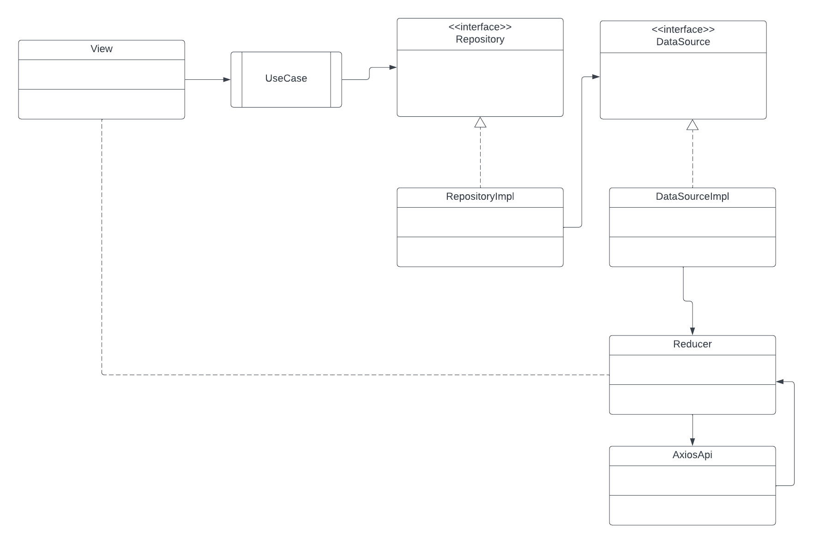

# Assessment

## Features

### 1. **Home Screen**

- Displays **10 random movies** on the home screen upon app launch.
- Includes a **search bar** to allow users to search for movies

### 2. **Search Functionality**

- Implements search functionality that fetches movies based on the entered title or keyword.
- The search results are displayed with a movie's poster and title.

### 3. **Movie Detail Screen**

- Displays detailed information about the selected movie, including:
  - Title
  - Description
  - Poster
  - Actors
  - Reviews (Not finished yet)
  - Keywords

### 4. **Cross-Platform Compatibility**

- Runs smoothly on both **iOS** and **Android** devices.

### 5. **Network Business Logic SDK**

- The SDK is designed with **Clean Architecture** principles, ensuring separation of concerns and flexibility.

#### SDK Architecture Overview

1. **Use Case Layer**: This layer holds the business logic. For example, `randomMovie` handles fetching random movies and communicates with the repository layer.
  
2. **Repository Layer**: The repository defines an interface to access movie data without depending on how or where the data is stored. It could retrieve data from different sources like a remote API or local storage.

3. **Data Source Layer**: The data source handles the actual data-fetching logic. You can implement:
   - **Remote DataSource**: Fetching movie data from an API using Axios or Fetch API.
   - **Local DataSource**: Retrieving cached data from local storage or a database. (Not used on this project)

#### Decoupling of Implementation

- The SDK does not couple directly with tools like **Redux** or **Axios**. The implementation details such as state management (e.g., Redux) and HTTP requests (e.g., Axios) are separate and can be swapped without affecting the SDK's core logic.
  
#### Architecture Flow

1. The **UI** layer (e.g., Home.tsx) interacts with the **UseCases** to trigger actions like searching for movies.
2. **UseCases** call the **Repository** layer, which defines the abstract methods for fetching data.
3. **DataSource**: The data source handles the actual data-fetching logic. You can implement:
   - **Remote DataSource**: Fetching movie data via trigger actions on Reducer.
   - **Local DataSource**: Retrieving cached data from local storage or a database.(Not used on this project)
   - **Redux Actions**: The DataSource is responsible for dispatching **Redux actions** when new data is fetched or an error occurs. These actions are handled by reducers to update the state.

4. **Side Effects via Redux Saga**: Any side effects, such as making API calls, are handled via **Redux Saga**. Sagas listen for dispatched actions and perform asynchronous tasks like API requests

#### Example Flow

- The user searches for a movie.
- The UI triggers the `randomMovie` from `MovieUseCases`.
- The `MovieUseCases` requests the movie data from the `MovieRepo`.
- The `MovieRepo` requests the movie data from the `MovieDataSource` (via an action ).
- The results is updated on Reducer's state and the UI is updated also

By separating the concerns and keeping the implementation decoupled, the SDK can be reused and extended easily.

---

**SDK Diagram**

```
           UI Layer
                 ↓
          Use Case Layer (Business Logic)
                 ↓
       Repository Layer (Abstract Data Access)
                 ↓
      Data Source Layer (Trigger Actions (or call API))
```

### 6. **State Management**

- The app integrates a state manager solution using **Redux** to handle:
  - Random movie data
  - Search results
  - Selected movie details

## Bonus Features

- Demonstrates the usage of the SDK in the React Native project for fetching and displaying movie data.For using this sdk:

``` bash
const usecase = new MovieUseCase(new MovieRepoImpl(new MovieDataSourceImpl()))
 ....
usecase.seach("text to search")
```

Please see the image for an intuitive


- Optimizes state manager solution for performance and efficiency.

  - Use Selector Functions (Memoization with useSelector)
  - Split Large State into Smaller Slices
  - Sagas Efficiently
  - Throttle/Debounce User Input
  - Concise and Scalable Store Setup (combineReducers)

## Technologies Used

- **React Native** with **TypeScript**
- **Redux** for state management
- **React Navigation** for navigating
between screens
- **Axios** for network requests

- **Clean Architecture**  for SDK architecture
- Setup multiple environments and configurations

## Setup Instructions

1. **Clone the repository:**

   ```bash
   git clone <https://github.com/tqdinh/Assessment.git>
   cd Assessment
   ```

2. **Install dependencies:**

   ```bash
   yarn
   ```

3. **Run the app:**

   For Android:

   ```bash
   yarn android:dev
   ```

   For iOS:

   open ios/MovieIMDB.xcworkspace with Xcode, build and run

    or

   ```bash
    yarn ios
   ```

## App Structure

- **src/pesentaion/**: Contains reusable UI components, screens for Home,Seach ,and Movie Detail
- **src/domain/**: Contains bussines logics and abstraction
- **src/data/**: Contains concrete implementation

- **src/redux/**: State management setup (actions, reducers, store).
- **src/saga/**: Handling side-effect
- **src/api/**: API handlers for fetching movies.

- **src/util/**: Contains words for random seaching, mapper from the responese to DTO and entity

## Todo

- Crawling review list
- Crawling actor's avatar
- Beautiful placeholder for image
- Beautiful loading indicator
